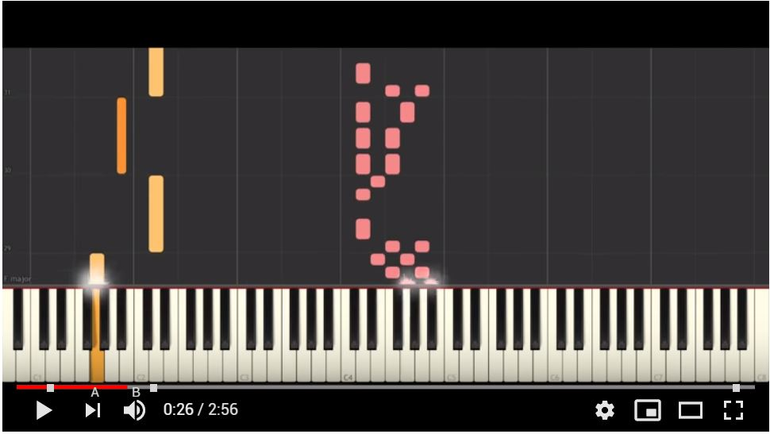
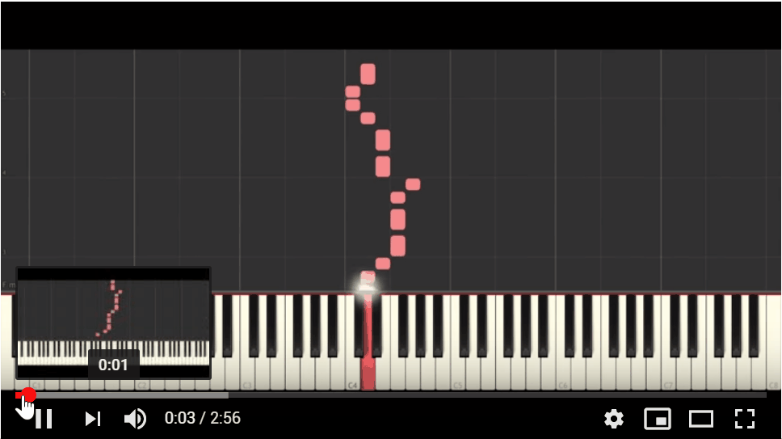
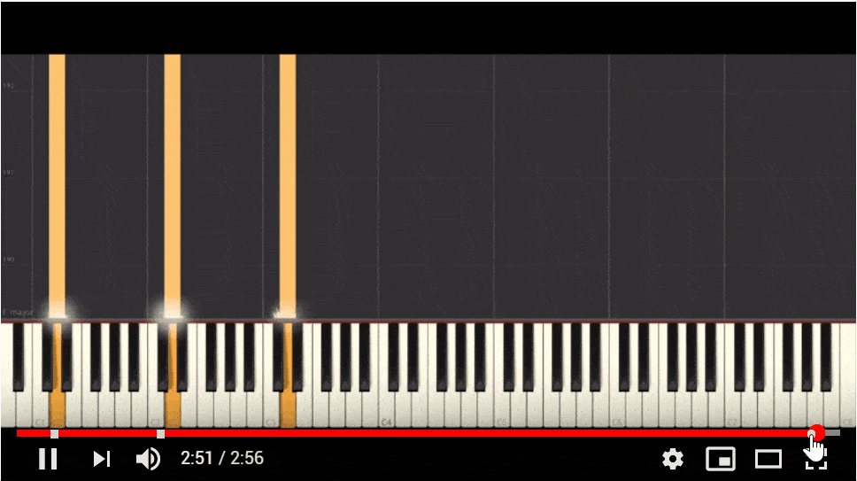
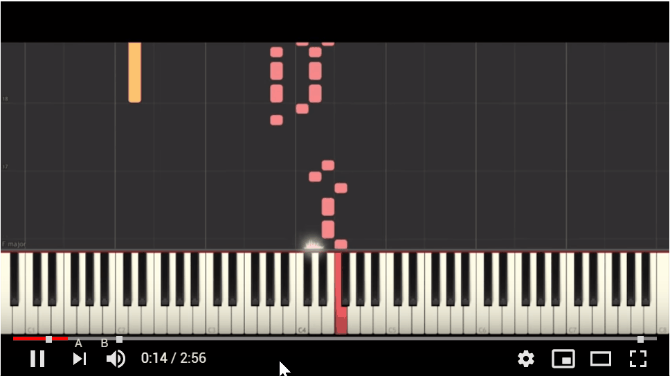
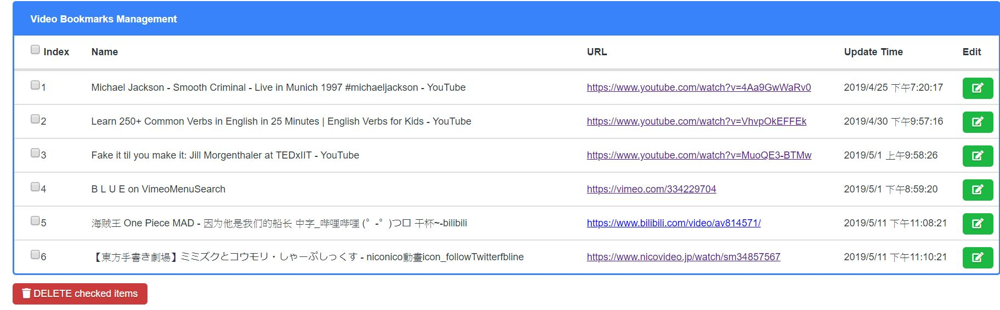
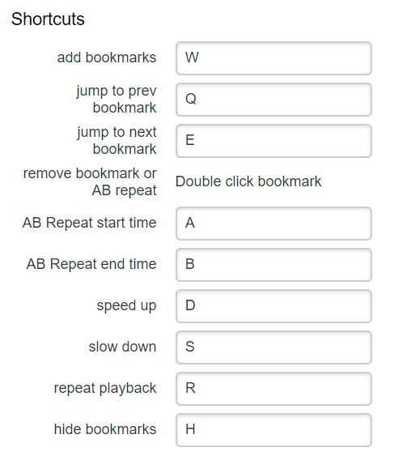

#  Video Bookmarks Controller

> Set and jump to bookmarks in HTML5 video with quick shortcuts.

## How to Use
1. Install Chrome extension [HERE](https://chrome.google.com/webstore/detail/video-bookmarks-controlle/mknjmmimahenojgmpamokenibeecfonh)
2. Start a video
3. Set and jump to bookmarks

## Screenshot
Add bookmark

Switch Bookmarks

AB Repeat

Remove Bookmark

## Feature
1. Bookmarks on video progress bar
2. Manage bookmarks which is separated from url
3. AB Repeat
4. Speed up or slow down
5. Reassign shortcut 

Bookmark management

## Shortcut
* `W` - add bookmarks.
* `Q` - jump to previous bookmark.
* `E` - jump to next bookmark.
* `A` - set AB Repeat start time.
* `B` - set AB Repeat end time.
* `S` - decrease playback speed.
* `D` - increase playback speed.
* `R` - toggle video repeating.
* `H` - toggle show/hide bookmarks.
* `Mouse Double Clicking` - remove specific bookmark.

You can reassign the default shortcut keys in the extensions settings page.

## Meta

Yichin Chiu – ichinchiou@gmail.com

MIT license

## Contributing

1. Fork it (<https://github.com/chiubeta/video_bookmarker/fork>)
2. Create your feature branch (`git checkout -b feature/fooBar`)
3. Commit your changes (`git commit -am 'Add some fooBar'`)
4. Push to the branch (`git push origin feature/fooBar`)
5. Create a new Pull Request
